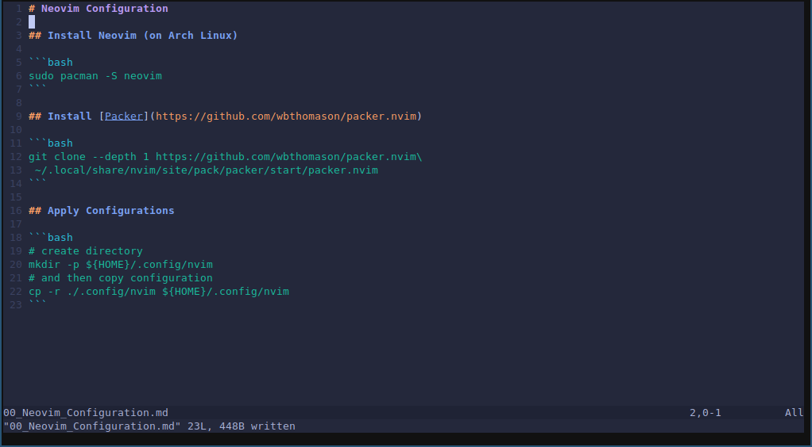
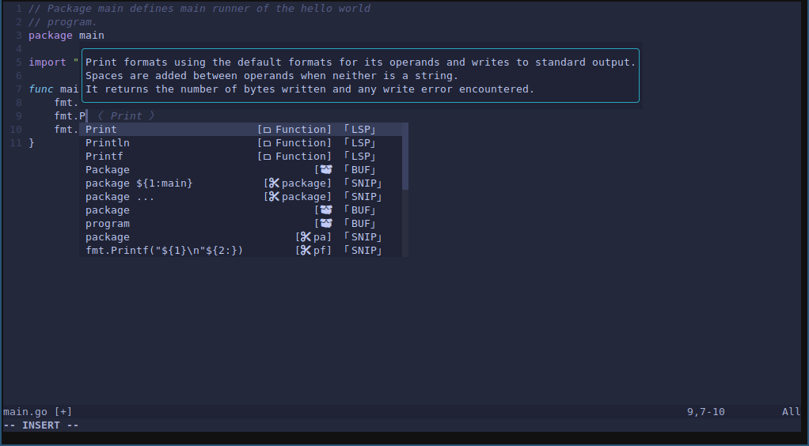
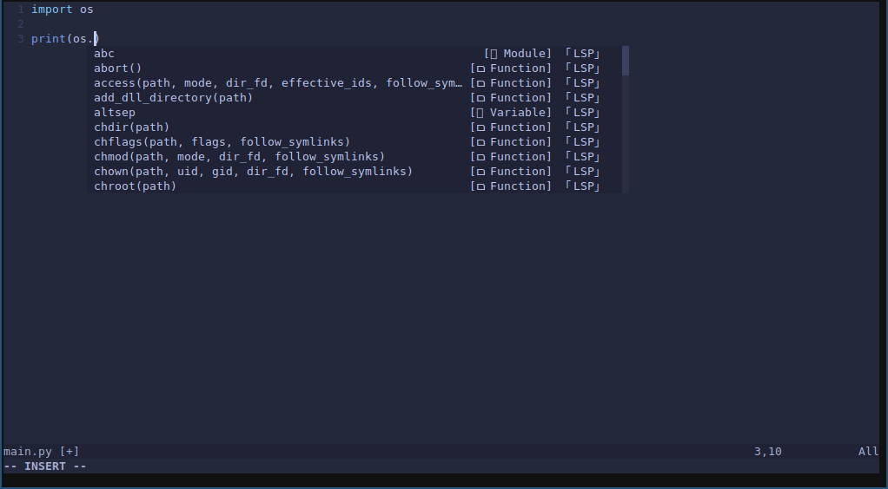

# Neovim Configuration

## Configuration Results

### Markdown



### Golang



### Python



## Install Neovim (on Arch Linux)

```bash
sudo pacman -S neovim
```

## Install [Packer](https://github.com/wbthomason/packer.nvim)

```bash
git clone --depth 1 https://github.com/wbthomason/packer.nvim\
 ~/.local/share/nvim/site/pack/packer/start/packer.nvim
```

## Apply Configurations

```bash
# create directory
mkdir -p ${HOME}/.config/nvim
# and then copy configuration
cp -r ./.config/nvim ${HOME}/.config/nvim
```
