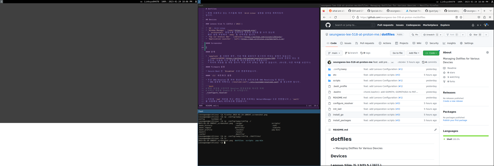

# dotfiles

* 현재 사용하고 있는 기기들에 대한 `Arch Linux` 설정을 모아둔 레파지토리
입니다.

## Devices

### Lenovo Slim 7i 13ITL5 (`2021`)

* `OS`: Arch Linux
* `Window Manager`: [sway](https://swaywm.org/)
  * `archinstall` 명령어를 입력하면 편하게 설정을 할 수가 있는데
  해당 설정 부분에서 `sway` 를 선택하면 됩니다.
* `Top (or Status) Bar`: [i3blocks](https://github.com/vivien/i3blocks)
* `Application Launcher`: [wofi](https://man.archlinux.org/man/wofi.1.en)

#### Screenshot



#### 문제

* `swaylock` 을 사용한 경우, 가끔 락을 걸었다가 로그인이 안되는 문제가 있습니다.
  * [swaylock#268](https://github.com/swaywm/swaylock/issues/268) 이슈와 관련이 있고
  비밀번호에 특수문자를 넣지 않고 사용자를 생성한 결과 정상적으로 로그인되는 것을 확인
  하였습니다.
    
#### Firmware 설정

* Secure Boot 만 `Disabled` 으로 변경하였습니다.

#### `(1)` 네트워크 설정

* 우선 DNS Resolver 를 켜야 정상적으로 네트워크에 DNS Resolving 이 됩니다.
  * DNS 설정에 대해서는 [resolved.conf](./etc/systemd/resolved.conf) 를 참고하면 됩니다.

```bash
# 해당 설정을 사용하면 Resolver 환경설정을 복사한 뒤에
# 서비스 데몬을 Enable 한 후 시작합니다.
./configure_resolver
```

* 이후에 `iwd` 데몬을 켜고 (해당 단계 이후에는 NetworkManager 으로 전환합니다.) `iwctl`
를 사용해서 WiFi 네트워크에 연결합니다.

```bash
./init_iwd
# 해당 데몬은 패키지 설치 후 재부팅하였을 때에는
# NetworkManager 을 사용하기 때문에 Enable 할 필요는
# 없습니다.
sudo systemctl start iwd
```

#### `(2)` 패키지 설치

* 해당 노트북에서 필요한 패키지 및 유틸리티를 설치합니다.
  * [install_packages](./install_packages) 스크립트를 참고하시면 됩니다.
  * 설치 단계에서 확인을 하도록 하기 위해서, `--noconfirm` 옵션을 넣어두진 않았습니다
  만약 해당 옵션이 필요하시다면 스크립트를 수정 후 사용하시기 바랍니다.

```bash
./install_packages
```

* 설치 이후 `sudo reboot` 을 통해서 재부팅을 진행하시기 바랍니다.

#### `(3)` NetworkManager 데몬 실행

* `iwd` 는 이상하게 `2.5Ghz` WiFi 를 잡지 못하므로, NetworkManager 를 사용하여
WiFi 를 잡도록 하겠습니다. 다음과 같이 데몬을 실행하시면 됩니다.

```bash
sudo systemctl enable NetworkManager
sudo systemctl start NetworkManager
```

* 이후 `nmcli` 를 통하여 WiFi 를 Scan 한 후 연결하시면 됩니다. 관련된 설정방법은 많으니
본 문서에서는 따로 기술하진 않겠습니다.

#### `(4)` 설정파일 복사

* `.bashrc` 및 `.bash_profile` 을 복사하여, 환경변수 설정 및 로그인 시 `sway` 를 자동으로 실행하도록
지정해 줍니다.

* `i3blocks` 상태바를 설정하기 위해서, [scripts](./scripts) 디렉토리에 있는 스크립트를
`$HOME/scripts` 디렉토리에 복사합니다.

* `sway` 환경설정을 위해서, `.config/sway` 디렉토리 내에 있는 환경설정 파일을 `$HOME/.config/sway`
디렉토리에 복사합니다.

* 이후 재부팅을 진행하거나, `sway` 명령어를 통해서 sway window manager 을 실행해보시면 됩니다.

#### `(5)` 한국어 입력기 설치하기

* [yay](https://github.com/Jguer/yay) 를 설치한 다음 다음 명령어를 사용하여
[kime](https://github.com/Riey/kime) 를 설치하면 됩니다.

```bash
yay kime
```

* `TODO`: `sway` 시작 시 `kime` 도 같이 실행되도록 환경설정 변경.

#### `(6)` Screenshot 유틸리티 설치

* [sway-interactive-screenshot](https://github.com/moverest/sway-interactive-screenshot)
를 설치하시면 되며, 환경설정을 수정하지 않으셨다면, `PrintScreen` 키를 입력하시면 스크린샷
을 찍으실 수 있습니다.

#### `(*)` Firefox 비디오 가속하기

* `about:config` 에서 `media.ffmpeg.vaapi.enabled` 를 True 로 변경하면 됩니다.